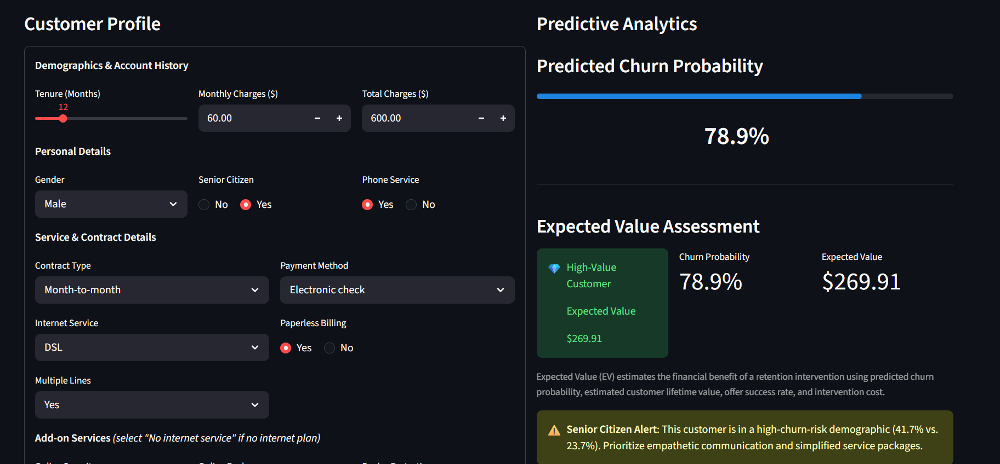
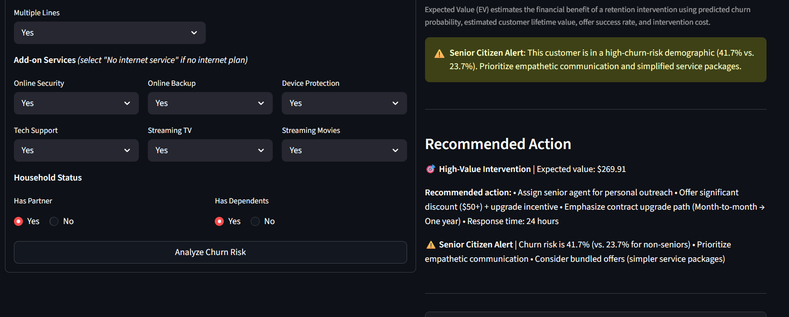
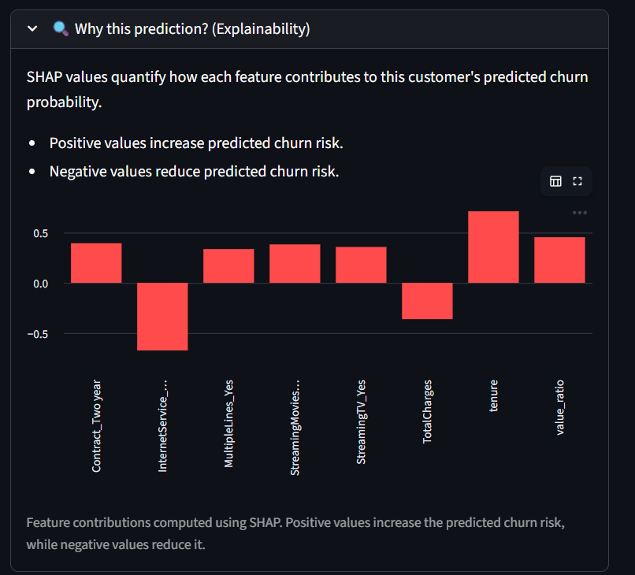

# Telco Customer Churn Engine
Python | FastAPI | Streamlit | Docker | Render | GitHub Actions

An end-to-end churn prediction system built around a simple premise: a probability score isn't a decision. This project goes from raw customer data to a calibrated, statistically-validated model, through fairness and uncertainty analysis, to a business-facing Expected Value engine that says not just *who* is at risk, but *whether it's worth intervening, and how much to spend doing it.*


**Live app:** https://telco-churn-prediction-engine.onrender.com
**API docs:** https://telco-churn-api-urtt.onrender.com/docs

[](https://github.com/amaanzz/-telco-churn-prediction-engine/actions/workflows/ci.yml)

<p align="center">
  
  
  
  
  
  
</p>
---

## Why this exists

Most churn projects stop at a metric:

> "Model accuracy = 82%"

That number doesn't answer the questions a retention team actually has:

- Which customers are worth intervening on?
- Is the expected benefit of an offer actually bigger than what it costs to make?
- Does the model behave fairly across customer groups, or is it just confident and wrong for some of them?
- How much should we trust a single probability number, and when should we not?

This project was built to answer those questions directly, not just produce a score.

---

## What makes this different from a typical churn project

| Typical churn project | This project |
|---|---|
| Optimizes for accuracy | Optimizes for a documented, asymmetric cost matrix (false negative ≈ lost revenue, false positive = $75 offer cost) |
| Handles imbalance with SMOTE by default | Tested SMOTE, SMOTENC, class-weighting, and threshold-moving head-to-head; threshold-moving won, backed by a McNemar's test |
| Reports a single risk score | Reports a full 90% conformal prediction interval, so the app knows when it's uncertain |
| "High risk → send a discount" | Expected Value engine: `EV = P(churn) × CLV_at_risk × offer_success_rate − cost_of_offer`, with every assumption stated and sensitivity-tested |
| Fairness audit as a checkbox | Audited by gender and senior-citizen status, then verified whether the disparity found was real (it was) rather than declaring the model "fair" or "unfair" off one number |
| A notebook | A notebook **and** a tested, containerized, CI/CD'd, publicly deployed two-service system |

---

## System architecture

```
User Browser
      │
      ▼
Streamlit Frontend (Render)
      │  HTTP / JSON
      ▼
FastAPI Backend (Render)
      │
      ▼
Preprocessing Pipeline (src/preprocess.py)
      │
      ▼
Logistic Regression Pipeline (models/pipeline.pkl)
      │
      ├──────────────┐
      ▼              ▼
 Churn Probability   SHAP Explainability (src/explainability.py)
      │
      ▼
Expected Value Retention Strategy (src/strategy.py)
```

The repository holds both services. `app.py` is the Streamlit entry point; `src/api.py` is the FastAPI entry point. Both import from the same `src/` package, so the retention-strategy logic and preprocessing are defined once and used identically on both sides of the HTTP boundary.

---

## The model, and how it was chosen

**Algorithm:** Logistic Regression, with a cost-optimal decision threshold rather than the default 0.5.

Early iterations of this project used SMOTE, like most churn tutorials do. That didn't survive scrutiny. A cost matrix was defined first (false negative = the customer's monthly revenue, false positive = $75, covering a $50 discount plus $25 of outreach labor), and five imbalance-handling strategies were benchmarked against it on identical data:

| Method | Total cost |
|---|---|
| **Threshold moving** | **$57,988** ✅ |
| Class weighting | $80,803 |
| SMOTE | $83,453 |
| SMOTENC | $105,309 |

The gap between threshold-moving and SMOTE was confirmed statistically significant with McNemar's test (χ² = 126.49, p ≈ 0.0000), and the resulting decision threshold (0.09) was checked for robustness against a 50% change in the false-positive cost assumption — it held.

Feature selection was done the same way: LASSO, RFE, and permutation importance all independently agreed that `yearly_charges` and `high_value` were redundant with `MonthlyCharges` (their permutation importance scores were identical to four decimal places — the signature of collinearity), so they were dropped from the production feature set.

Calibration (`CalibratedClassifierCV`) was tested and rejected — the Brier score improvement was negligible (0.1387 → 0.1386), and it wasn't worth losing direct SHAP interpretability for.

---

## Beyond point predictions

**Conformal prediction.** Rather than a single probability, the model can produce a 90% prediction set (via `mapie`). Empirical coverage on held-out data came out to 90.8%, and about 27% of customers land in a genuinely uncertain, set-valued prediction — a category a point estimate would hide.

**Survival analysis.** Kaplan-Meier curves fit per contract type give a much better estimate of a customer's remaining lifetime than a flat 12-month assumption:

| Contract type | Expected remaining lifetime (72-month horizon) |
|---|---|
| Month-to-month | 36.3 months |
| One year | 66.4 months |
| Two year | 71.5 months |

This feeds directly into the CLV calculation used by the Expected Value engine below.

**Counterfactual explanations.** Using DiCE with a genetic search and range constraints (so it can't suggest logically impossible states, like adding streaming service to a customer with no internet), the model surfaces concrete "what would change this prediction" actions. One finding: for a boundary customer, upgrading from a month-to-month to a one-year contract alone was enough to flip predicted risk from 70% to under 50%.

---

## Fairness audit

Audited with `fairlearn` across gender and senior-citizen status:

| Group | Selection rate | Demographic parity diff | Equalized odds diff |
|---|---|---|---|
| Gender (F vs M) | 0.675 / 0.621 | 0.054 | 0.063 |
| Senior citizen (No vs Yes) | 0.601 / 0.884 | 0.283 | 0.312 |

Gender showed no meaningful disparity. Senior citizen status did — but the audit didn't stop at the disparity number. Checking actual outcomes showed seniors churn at **41.7%** versus **23.7%** for non-seniors — a real, substantial underlying difference, not a modeling artifact. Precision for seniors was also *higher* (0.463 vs 0.368), meaning the model isn't over-flagging them either; it's correctly identifying a group that genuinely churns more. The conclusion drawn was that this group warrants a dedicated retention strategy, not that the model needs to be "corrected" to hide a real pattern.

---

## Expected Value engine

The core of what turns this from a classifier into a decision tool:

```
EV = P(churn) × CLV_at_risk × offer_success_rate − cost_of_offer
```

- `CLV_at_risk` uses the survival-informed remaining lifetime above, not a flat multiplier — and it's computed *conditionally* from the customer's current tenure, so a long-tenured outlier customer doesn't get a nonsensical near-zero CLV the way a naive `segment_average − tenure` calculation would.
- `offer_success_rate = 0.30` is a stated business assumption (no historical A/B data exists for this), tested for sensitivity across 0.15–0.40 to confirm the tier distribution doesn't collapse under reasonable variation.
- `cost_of_offer = $75` is the same figure used in the Phase 1 cost matrix, kept consistent rather than invented twice.

At the baseline assumption, customers fall into three actionable tiers:

| Tier | Share of customers | Action |
|---|---|---|
| High-value (EV > $200) | 17.5% | Senior agent outreach, significant offer |
| Standard (EV $0–$200) | 20.7% | Automated retention offer |
| No action (EV ≤ $0) | 61.8% | Monitor only — intervention costs more than it's expected to save |

---

## Explainability

Every prediction returned by the API includes SHAP values (`shap.LinearExplainer`) computed against a background sample exported from the training set. The Streamlit app renders these as a live bar chart showing which features pushed a given customer's risk up or down — so a "72% churn risk" is never a black box, it comes with a reason.

---

## Production engineering

This isn't just a model in a notebook — it's tested, versioned, containerized, and deployed as two independently running services.

- **Testing:** 45+ `pytest` unit tests covering feature engineering, CLV/EV math, and tier assignment, including edge cases (zero tenure, tenure outliers, probability boundaries).
- **CI/CD:** GitHub Actions runs the test suite, linting, type checks, and a security scan on every push.
- **Experiment tracking:** MLflow logs the Phase 1 ablation study, Phase 2 fairness/coverage metrics, and Phase 3 sensitivity analysis, so every result in this README is reproducible from logged runs, not just narrated.
- **Containerization:** A multi-stage Dockerfile and `docker-compose.yml` run the Streamlit app, FastAPI backend, and MLflow UI as three services locally.
- **Deployment:** The FastAPI backend and Streamlit frontend are deployed as two separate services on Render, communicating over HTTP, with the frontend's API endpoint configured via an environment variable rather than hardcoded.

---

## Project structure

```
CustomerChurn/
├── app.py                     # Streamlit frontend — calls the deployed API
├── src/
│   ├── preprocess.py          # Feature engineering
│   ├── predict.py             # Model inference
│   ├── strategy.py            # EV-based retention strategy (shared by both services)
│   ├── explainability.py      # SHAP value computation
│   ├── api.py                 # FastAPI backend
│   └── mlflow_logger.py       # Experiment tracking
├── tests/                     # 45+ unit tests
├── .github/workflows/ci.yml   # CI/CD pipeline
├── models/
│   ├── pipeline.pkl           # Trained preprocessing + classifier pipeline
│   └── shap_background.pkl    # Background sample for SHAP
├── notebook/                  # Full model development history
├── Dockerfile
├── docker-compose.yml
├── requirements.txt           # Exact-pinned production dependencies
└── runtime.txt                # Python version for cloud deployment
```

---

## Running locally

### Option 1 — plain Python

```bash
git clone https://github.com/amaanzz/-telco-churn-prediction-engine.git
cd -telco-churn-prediction-engine
pip install -r requirements.txt
streamlit run app.py
```

### Option 2 — Docker (all three services)

```bash
docker-compose up
```

- Streamlit: `http://localhost:8501`
- FastAPI: `http://localhost:8000/docs`
- MLflow: `http://localhost:5000`

### Running the tests

```bash
pytest tests/ -v --cov=src
```

---

## Calling the API directly

```bash
curl -X POST https://telco-churn-api-urtt.onrender.com/predict \
  -H "Content-Type: application/json" \
  -d '{
    "gender": "Male",
    "senior_citizen": 0,
    "partner": "Yes",
    "dependents": "No",
    "tenure": 7,
    "phone_service": "Yes",
    "multiple_lines": "No",
    "internet_service": "Fiber optic",
    "online_security": "Yes",
    "online_backup": "No",
    "device_protection": "Yes",
    "tech_support": "Yes",
    "streaming_tv": "No",
    "streaming_movies": "No",
    "contract": "Month-to-month",
    "paperless_billing": "Yes",
    "payment_method": "Electronic check",
    "monthly_charges": 78.55,
    "total_charges": 549.85
  }'
```

Returns churn probability, EV tier, the recommended action, and per-feature SHAP contributions.

---

## Screenshots

**Dashboard**



**Explainability**


---

## What I learned

- A model that "handles imbalance" and a model that's actually cost-optimal are not the same thing — SMOTE looked reasonable until it was benchmarked against threshold-moving on an actual cost matrix, and lost.
- A disparity in a fairness metric isn't automatically a bug. Checking the underlying data before concluding anything about the model matters more than the fairness metric itself.
- Getting a model deployed exposes an entirely different category of problem than getting it to train: pickle compatibility across scikit-learn versions, Python version drift on cloud platforms, and dependency resolution conflicts between packages that were never designed to be pinned together. None of that shows up in a notebook.
- Explainability isn't a nice-to-have bolted on at the end — routing SHAP through an API boundary and rendering it live is a meaningfully different engineering problem than computing it once in a notebook cell.

## What's next

- Hyperparameter optimization with Optuna (currently using defaults/manual tuning)
- A SQL-backed data layer instead of a static CSV, for realistic batch scoring
- Drift monitoring (Evidently) to catch when the training distribution stops matching production traffic

---
## Resume-ready project summary

Built and deployed a production-style telecom customer churn prediction platform using **FastAPI, Streamlit, Docker, SHAP, and Render**, with an **Expected Value (EV) retention engine**, **fairness auditing**, **conformal prediction**, and **public REST API deployment** connected through a two-service cloud architecture.
## Author
---
**Amaan Shaikh**
B.Tech student, applied machine learning and end-to-end ML systems.

If you check this out, feedback and questions are always welcome.
